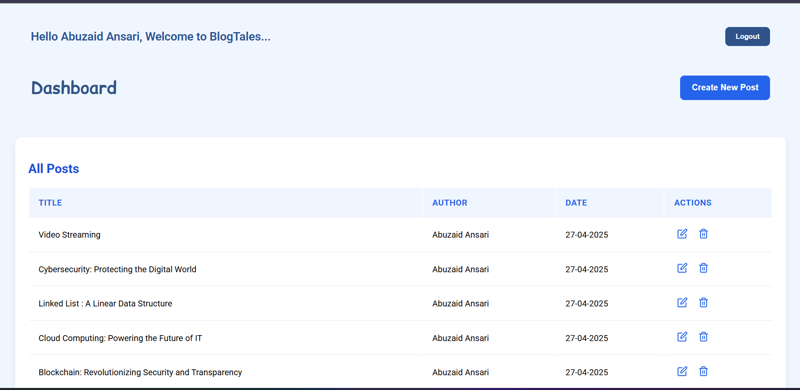

# BlogTales

A full-stack blog application built with React, Node.js, Express, and MongoDB.  
It features user authentication, role-based access control (admin/user), blog post management (create, update, delete), and secure JWT-based login.

---

## Tech Stack

- **Frontend**: React.js, React Router DOM
- **Backend**: Node.js, Express.js
- **Database**: MongoDB (Mongoose)
- **Authentication**: JWT (JSON Web Tokens)
- **Cloud Storage**: Cloudinary (for blog post thumbnails)
- **Other Libraries**:  
  - `validator` for email validation  
  - `multer` for handling file uploads  
  - `dotenv` for environment variables  
  - `bcryptjs` for password hashing
  - `send-in-blue` for sending email
  - `cloudinary` for uploading images on cloud
---

## Folder Structure

```
/api
  /controllers
    auth.js
    post.js
    user.js
  /db
    connectDB.js
  /errors
    custom-error.js  
  /middlewares
    asyncWrap.js
    auth.js
    authorize.js
    errorHandler.js
    notFound.js
  /models
    user.js
    post.js
  /utils
    cloudinary.js
    generateToken.js
    sendToken.js
    fileStorage.js
    sendEmail.js
    sendToken.js
  /routes
    admin.js
    auth.js
    user.js
  index.js
  .env
/client
  /src
    /components
      PrivateRoute/
      BlogCard/
      Navbar/
    /pages
      Blogs/
      CreatePost/UpdatePost/
      Dashboard/
      Login/
      Register/
      SinglePost/
    App.js
    App.css
    .env
```

---

## Environment Variables

Create a `.env` file in your `/backend` directory with the following variables:

```bash
MONGO_URI=your_mongodb_connection_string
JWT_SECRET=your_jwt_secret_key
REACT_URL=http://localhost:3000
CLOUDINARY_CLOUD_NAME=your_cloudinary_cloud_name
CLOUDINARY_API_KEY=your_cloudinary_api_key
CLOUDINARY_API_SECRET=your_cloudinary_api_secret
BASE_URL=http://localhost:3000/api/auth
REACT_URL=http://localhost:5173
PORT=3000
```

---

## Installation

### 1. Clone the Repository

```bash
git clone https://github.com/your-username/blogtales.git
cd blogtales
```

### 2. Install Backend Dependencies

```bash
cd api
npm install
```

### 3. Install Frontend Dependencies

```bash
cd ../client
npm install
```

---

## Running the Application Locally

### Start the Backend Server
```bash
cd api
npm start
```
- Backend will run on [http://localhost:3000](http://localhost:3000)

### Start the Frontend
```bash
cd frontend
npm start
```
- Frontend will run on [http://localhost:5173](http://localhost:5173)

> Both servers must be running simultaneously for full functionality.

---

## Major Features

- User Registration with Email Verification
- User Login (only after email verification)
- JWT-based Authentication and Authorization
- Role-based Access Control (Admin can create/update/delete posts)
- Create, Update, Delete, and Fetch Blog Posts
- Secure Password Storage (hashed with bcrypt)
- Image Upload via Cloudinary
- Protected Routes for Admin Panel (Dashboard, Create Post, Update Post)

---

## API Endpoints (Summary)

| Method | Endpoint                     | Access    | Description                   |
|--------|-------------------------------|-----------|-------------------------------|
| POST   | `/api/v1/auth/register`        | Public    | Register a new user           |
| GET    | `/api/v1/auth/verify-email`    | Public    | Verify email with token       |
| GET    | `/api/v1/auth/resend-token`    | Public    | Resend verification email     |
| POST   | `/api/v1/auth/login`           | Public    | Login user                    |
| GET    | `/api/v1/posts`                | Public    | Get all posts                 |
| GET    | `/api/v1/posts/:postId`         | Public    | Get single post               |
| POST   | `/api/v1/posts`                | Admin     | Create a new post             |
| PATCH  | `/api/v1/posts/:id`             | Admin     | Update a post                 |
| DELETE | `/api/v1/posts/:id`             | Admin     | Delete a post                 |
| GET    | `/api/v1/users/:userId`         | Admin     | Fetch a user's details        |

---

## Screenshots

**Register Page**
 

**Login Page** 
 

**Blogs Listing Page** 
 

**Single Post View** 


**Create Post (Admin)** 
 

**Update Post (Admin)** 
 

**Dashboard (Admin)** 
 

---

# Final Note

This project serves as a production-ready base for building more blogging platforms, focusing on best practices like clean code structure, error handling, and secure authentication.
